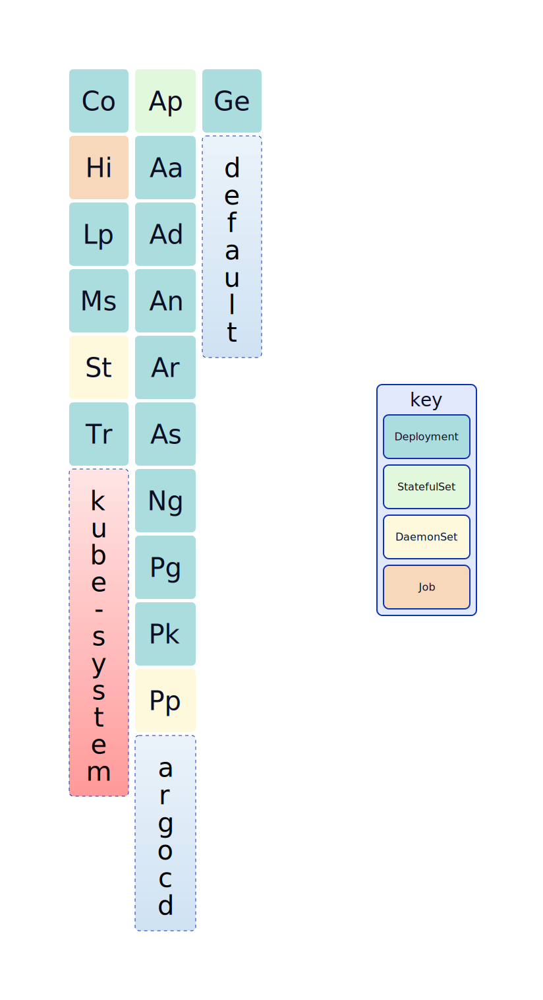

# kube-periodic

Displays kubernetes workloads as a periodic table. This uses [d2lang](https://d2lang.com/) for creating the diagram.

Limitations: workloads use two characters as such duplication of the same key pair results in a single element in the table.
I considered adding handling for duplicates via superscript/subscript notation; however, this is just a tiny personal
project so it's probably not worth the effort. 

## Instructions and Requirements
Requirements: d2
```sh
# with Just
just run

# without Just
go run .
d2 <output> --watch
```

## Output

